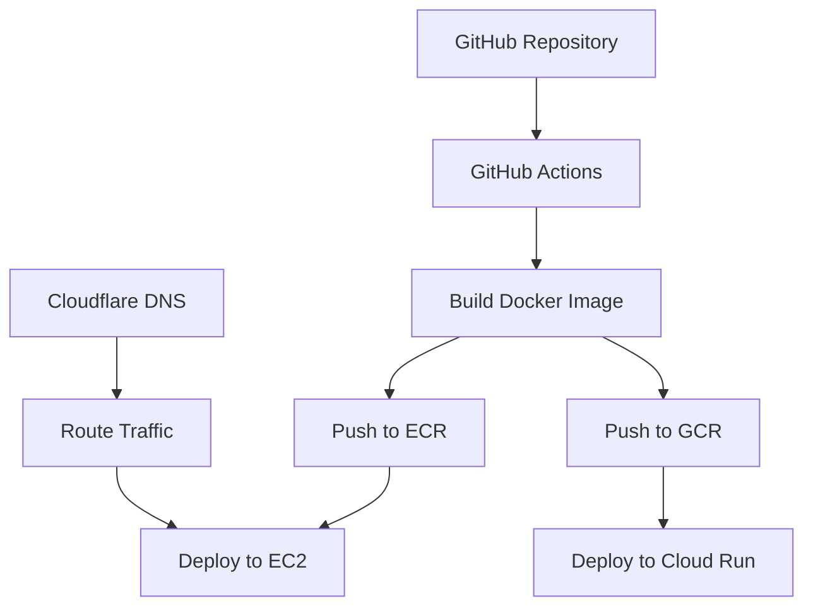

# Daily DevOps

Daily DevOps Quiz is a web application hosted on JordanWhite.dev that provides daily DevOps learning through interactive quizzes. The project features a modern Next.js frontend, Firestore database, and infrastructure managed across multiple cloud providers (AWS/GCP) with automated deployments using GitHub Actions.

## Features

### Frontend

- Built with Next.js, React, and TailwindCSS
- Interactive quiz interface with daily DevOps questions
- Historical view of past questions
- Detailed explanations for correct answers
- Responsive design using HeroUI components

### Database

- Firebase/Firestore for data storage
- Direct database integration with Next.js frontend
- Secured access through Firebase configuration

### Content Generation

- Python scheduler runs weekly via GitHub Actions
- Leverages OpenAI API to generate DevOps quiz content
- Automatically stores new questions in Firestore

### Infrastructure

- Multi-cloud deployment capability:
  - Primary hosting on AWS EC2
  - Failover capability to Google Cloud Run
- DNS management through Cloudflare
- Infrastructure as Code using Terraform
- Automated deployments via GitHub Actions

## Architecture

### Frontend Application

- Next.js React application
- TailwindCSS for styling
- HeroUI component library
- Firebase SDK for database interactions
- Containerised with Docker

### Infrastructure

- Primary Deployment:
  - AWS EC2 for application hosting
  - Amazon ECR for container registry
- Failover Setup:
  - Google Cloud Run
  - Google Container Registry
- DNS & Security:
  - Cloudflare for DNS management and routing
  - SSL/TLS certification

### CI/CD Pipelines

- GitHub Actions workflows for:
  - Docker image building and pushing
  - AWS EC2 deployment
  - GCP Cloud Run deployment
  - Infrastructure provisioning via Terraform
  - Content generation scheduling

## Tech Stack

- **Frontend**: Next.js, React, TailwindCSS, HeroUI
- **Database**: Firebase/Firestore
- **Content Generation**: Python, OpenAI API
- **Infrastructure**:
  - AWS (EC2, ECR)
  - GCP (Cloud Run)
  - Cloudflare (DNS)
- **IaC**: Terraform
- **Containerisation**: Docker
- **Automation**: GitHub Actions

## Deployment Architecture

